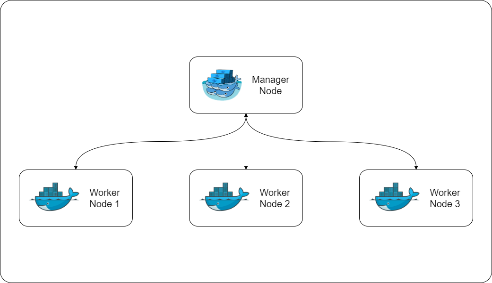
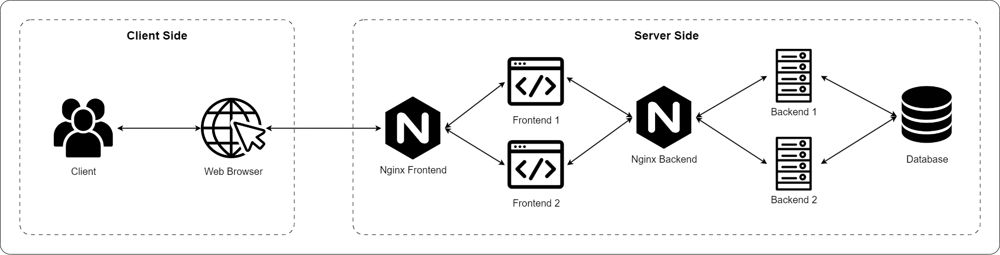

# Rencana Implementasi: Membangun Aplikasi Microservice dengan Docker Swarm

## Tujuan
Membangun dan menjalankan aplikasi microservice menggunakan Docker Swarm pada multiple nodes (1 manager node + 3 worker nodes) dengan fitur high availability, load balancing, dan auto-scaling.

## Prasyarat

### Hardware & Software
- **4 Node** (1 Manager + 3 Worker):
  - Minimal 2GB RAM per node
  - Docker Engine terinstall di semua node
  - Network connectivity antar node
  - SSH access ke semua node
- **Manager Node**:
  - Docker Swarm init capability
  - Docker Registry setup
  - NFS Server setup
- **Worker Nodes**:
  - NFS Client setup
  - Docker Registry access configuration

### Network Requirements
- Port 80 (nginx-frontend)
- Port 8080 (nginx-backend) - exposed as 8000
- Port 4000 (Docker Registry)
- Port 2377 (Swarm management)
- Port 7946 (Container network discovery)
- Port 4789 (Overlay network)

## Arsitektur Aplikasi

Aplikasi terdiri dari 5 services dengan konfigurasi replicas:
1. **nginx-frontend**: Web server untuk frontend (1 replica, Port 80)
2. **frontend**: Aplikasi Next.js (2 replicas)
3. **nginx-backend**: Web server untuk backend (1 replica, Port 8080)
4. **backend**: Aplikasi Node.js/Express (2 replicas, Port 5000)
5. **database**: PostgreSQL database (1 replica)




### Jaringan (Overlay Networks)
- **web-network**: Jaringan untuk frontend dan nginx-frontend (overlay)
- **api-network**: Jaringan untuk backend dan nginx-backend (overlay)
- **db-network**: Jaringan untuk backend dan database (overlay)

### Volume
- **db**: Volume untuk data PostgreSQL (NFS - shared across nodes)
- **backend**: Volume untuk data backend (local)
- **frontend**: Volume untuk data frontend (local)

### Placement Constraints
- Semua services dideploy pada **worker nodes** (kecuali manager jika juga worker)
- Database: 1 replica pada worker node
- Backend: 2 replicas pada worker nodes
- Frontend: 2 replicas pada worker nodes
- Nginx services: 1 replica pada worker nodes

## Langkah-Langkah Implementasi

### Fase 1: Persiapan Infrastruktur

#### 1.1 Setup Docker Swarm Cluster
- [ ] **Manager Node**: Inisiasi Docker Swarm
  ```bash
  docker swarm init --advertise-addr <ip-address-manager>
  ```
- [ ] **Manager Node**: Simpan join token untuk worker nodes
- [ ] **Worker Node 1**: Join ke swarm menggunakan token
  ```bash
  docker swarm join --token <swarm-token> <ip-address-manager>:2377
  ```
- [ ] **Worker Node 2**: Join ke swarm menggunakan token
- [ ] **Worker Node 3**: Join ke swarm menggunakan token
- [ ] **Manager Node**: Verifikasi semua node terhubung
  ```bash
  docker node ls
  ```
- [ ] Pastikan status semua node adalah **Active**

#### 1.2 Setup Docker Registry
- [ ] **Manager Node**: Jalankan Docker Registry
  ```bash
  docker run -d -p 4000:5000 --restart=always --name registry registry:2
  ```
- [ ] **Semua Node**: Konfigurasi insecure registry
  - Edit `/etc/docker/daemon.json` (buat jika tidak ada)
  ```json
  {
    "insecure-registries": ["<ip-manager>:4000"]
  }
  ```
- [ ] **Semua Node**: Restart Docker daemon
  ```bash
  sudo systemctl restart docker
  ```
- [ ] **Manager Node**: Verifikasi registry berjalan
  ```bash
  curl -X GET http://<ip-manager>:4000/v2/_catalog
  ```

#### 1.3 Setup NFS Server (Manager Node)
- [ ] Install NFS kernel server
  ```bash
  sudo apt install nfs-kernel-server
  ```
- [ ] Buat directory untuk shared data
  ```bash
  sudo mkdir /etc/db-data
  ```
- [ ] Konfigurasi NFS exports
  - Edit `/etc/exports`, tambahkan:
  ```
  /etc/db-data *(rw,sync,no_subtree_check,no_root_squash)
  ```
- [ ] Restart exportfs
  ```bash
  sudo exportfs -ra
  ```
- [ ] Verifikasi NFS berjalan
  ```bash
  sudo systemctl status nfs-kernel-server
  ```

#### 1.4 Setup NFS Client (Worker Nodes)
- [ ] **Semua Worker Nodes**: Install NFS client
  ```bash
  sudo apt install nfs-common
  ```
- [ ] **Semua Worker Nodes**: Test mount (opsional)
  ```bash
  sudo mount -t nfs <ip-manager>:/etc/db-data /mnt/test
  sudo umount /mnt/test
  ```

### Fase 2: Download dan Konfigurasi Aplikasi

#### 2.1 Clone Repository
- [ ] **Manager Node**: Clone repository
  ```bash
  git clone https://github.com/arsitektur-jaringan-komputer/Pelatihan-Docker.git
  ```
- [ ] **Manager Node**: Masuk ke direktori
  ```bash
  cd Pelatihan-Docker/4.2\ Membangun\ Aplikasi\ di\ Docker\ swarm/compose/
  ```
- [ ] Verifikasi semua file dan folder tersedia

#### 2.2 Konfigurasi Docker Compose
- [ ] Edit `docker-compose.yaml`
- [ ] Ganti semua `<ip-manager>` dengan IP address manager node yang sebenarnya
- [ ] Verifikasi konfigurasi:
  - [ ] Image names menggunakan format: `<ip-manager>:4000/<service-name>`
  - [ ] Network drivers menggunakan `overlay`
  - [ ] Volume db menggunakan NFS driver
  - [ ] Replicas sesuai kebutuhan
  - [ ] Placement constraints untuk worker nodes

#### 2.3 Konfigurasi Nginx (Opsional - jika menggunakan domain)
- [ ] Edit `nginx/nginx-frontend.conf`
  - Ganti `server_name localhost` dengan domain name
- [ ] Edit `nginx/nginx-backend.conf`
  - Ganti `server_name localhost` dengan domain name

#### 2.4 Konfigurasi Frontend Environment
- [ ] **Jika tidak menggunakan localhost**: Buat/edit file `.env` di folder `frontend/`
  ```
  NEXT_PUBLIC_APP_NAME="<nama-aplikasi>"
  NEXT_PUBLIC_API_ENDPOINT="http://<ip-manager>:8000/"
  ```
- [ ] **Jika menggunakan build args**: Update Dockerfile frontend untuk menerima build args
  - Tambahkan ARG dan ENV untuk `NEXT_PUBLIC_API_ENDPOINT`
  - Update docker-compose.yaml untuk pass build args

### Fase 3: Build dan Push Images

#### 3.1 Build Images
- [ ] **Manager Node**: Build semua images
  ```bash
  docker compose build
  ```
- [ ] Verifikasi semua images ter-build
  ```bash
  docker images
  ```
- [ ] Pastikan ada 5 images:
  - database
  - backend
  - frontend
  - nginx-frontend
  - nginx-backend

#### 3.2 Tag Images untuk Registry
- [ ] **Manager Node**: Tag semua images dengan registry prefix
  ```bash
  docker tag <image-name> <ip-manager>:4000/<image-name>
  ```
- [ ] Atau build langsung dengan tag:
  ```bash
  docker compose build
  docker compose push
  ```

#### 3.3 Push Images ke Registry
- [ ] **Manager Node**: Push semua images ke registry
  ```bash
  docker push <ip-manager>:4000/database
  docker push <ip-manager>:4000/backend
  docker push <ip-manager>:4000/frontend
  docker push <ip-manager>:4000/nginx-frontend
  docker push <ip-manager>:4000/nginx-backend
  ```
- [ ] Verifikasi images di registry
  ```bash
  curl -X GET http://<ip-manager>:4000/v2/_catalog | json_pp
  ```

### Fase 4: Deploy Stack ke Docker Swarm

#### 4.1 Deploy Stack
- [ ] **Manager Node**: Deploy stack menggunakan docker-compose.yaml
  ```bash
  docker stack deploy -c docker-compose.yaml musicapp
  ```
- [ ] Tunggu beberapa saat hingga semua services ter-deploy

#### 4.2 Verifikasi Deployment
- [ ] **Manager Node**: Cek status semua services
  ```bash
  docker stack services musicapp
  ```
- [ ] Pastikan semua services memiliki replicas sesuai konfigurasi
- [ ] **Manager Node**: Cek detail setiap service
  ```bash
  docker service ps musicapp_db
  docker service ps musicapp_backend
  docker service ps musicapp_frontend
  docker service ps musicapp_nginx-frontend
  docker service ps musicapp_nginx-backend
  ```
- [ ] Pastikan semua tasks berstatus **Running**

#### 4.3 Verifikasi Networks
- [ ] **Manager Node**: Cek overlay networks
  ```bash
  docker network ls
  ```
- [ ] Pastikan ada 3 overlay networks:
  - musicapp_db-network
  - musicapp_web-network
  - musicapp_api-network

#### 4.4 Verifikasi Volume
- [ ] **Manager Node**: Cek volume NFS
  ```bash
  docker volume ls
  ```
- [ ] **Manager Node**: Inspect volume db
  ```bash
  docker volume inspect musicapp_db
  ```

### Fase 5: Testing dan Verifikasi

#### 5.1 Test Aplikasi
- [ ] Akses aplikasi melalui browser: `http://<ip-manager>`
- [ ] Test fitur login
- [ ] Test fitur register
- [ ] Test CRUD operations (songs, albums, playlists)
- [ ] Verifikasi data tersimpan di database

#### 5.2 Test Load Balancing
- [ ] **Manager Node**: Cek distribusi tasks
  ```bash
  docker service ps musicapp_backend
  docker service ps musicapp_frontend
  ```
- [ ] Pastikan tasks terdistribusi ke multiple worker nodes
- [ ] Test dengan multiple requests untuk verifikasi load balancing

#### 5.3 Test High Availability
- [ ] **Manager Node**: Scale up backend service
  ```bash
  docker service scale musicapp_backend=3
  ```
- [ ] Verifikasi task baru terbuat dan running
- [ ] **Manager Node**: Stop salah satu worker node (simulasi failure)
- [ ] Verifikasi Docker Swarm otomatis memindahkan tasks ke node lain
- [ ] Restart worker node yang di-stop
- [ ] Verifikasi node kembali aktif

#### 5.4 Monitor Logs
- [ ] **Manager Node**: Monitor logs semua services
  ```bash
  docker service logs -f musicapp_backend
  docker service logs -f musicapp_frontend
  docker service logs -f musicapp_db
  ```
- [ ] Periksa apakah ada error atau warning

### Fase 6: Maintenance dan Monitoring

#### 6.1 Monitoring Commands
- [ ] **Manager Node**: Monitor stack services
  ```bash
  docker stack services musicapp
  ```
- [ ] **Manager Node**: Monitor node status
  ```bash
  docker node ls
  ```
- [ ] **Manager Node**: Monitor tasks
  ```bash
  docker stack ps musicapp
  ```

#### 6.2 Scaling Services
- [ ] **Manager Node**: Scale up/down services sesuai kebutuhan
  ```bash
  docker service scale musicapp_backend=3
  docker service scale musicapp_frontend=3
  ```
- [ ] Verifikasi scaling berhasil

#### 6.3 Update Services
- [ ] **Manager Node**: Update service (rolling update)
  ```bash
  docker service update --image <ip-manager>:4000/backend:new-tag musicapp_backend
  ```
- [ ] Verifikasi update berjalan dengan rolling update (zero downtime)

#### 6.4 Backup Database
- [ ] **Manager Node**: Backup database volume
  ```bash
  docker run --rm -v musicapp_db:/data -v $(pwd):/backup alpine tar czf /backup/db-backup.tar.gz /data
  ```

### Fase 7: Troubleshooting

#### 7.1 Common Issues

**Masalah: Service tidak bisa start**
- [ ] Cek logs: `docker service logs <service-name>`
- [ ] Cek node resources: `docker node inspect <node-name>`
- [ ] Verifikasi image tersedia di registry
- [ ] Cek network connectivity antar nodes

**Masalah: Database connection error**
- [ ] Verifikasi NFS mount berfungsi
- [ ] Cek volume configuration di docker-compose.yaml
- [ ] Verifikasi network db-network terbuat
- [ ] Cek environment variables di backend service

**Masalah: Frontend tidak bisa connect ke backend**
- [ ] Verifikasi NEXT_PUBLIC_API_ENDPOINT configuration
- [ ] Cek nginx-backend service status
- [ ] Verifikasi api-network terbuat dan terhubung
- [ ] Test connectivity: `curl http://<ip-manager>:8000`

**Masalah: Images tidak bisa di-pull di worker nodes**
- [ ] Verifikasi insecure-registries configuration
- [ ] Test registry access: `curl http://<ip-manager>:4000/v2/_catalog`
- [ ] Restart Docker daemon di worker nodes
- [ ] Cek firewall rules

**Masalah: NFS mount error**
- [ ] Verifikasi NFS server running di manager node
- [ ] Cek /etc/exports configuration
- [ ] Test mount manual di worker node
- [ ] Cek network connectivity antara nodes

#### 7.2 Debug Commands
```bash
# Inspect service
docker service inspect <service-name>

# Inspect network
docker network inspect <network-name>

# Inspect node
docker node inspect <node-name>

# View service logs
docker service logs <service-name>

# View task logs
docker service logs <task-id>

# Check service events
docker service ps <service-name>
```

### Fase 8: Cleanup (Jika Diperlukan)

#### 8.1 Remove Stack
- [ ] **Manager Node**: Remove stack
  ```bash
  docker stack rm musicapp
  ```
- [ ] Tunggu hingga semua services ter-remove
- [ ] Verifikasi: `docker stack services musicapp` (should be empty)

#### 8.2 Remove Registry (Opsional)
- [ ] **Manager Node**: Stop dan remove registry container
  ```bash
  docker stop registry
  docker rm registry
  ```

#### 8.3 Leave Swarm (Worker Nodes)
- [ ] **Worker Nodes**: Leave swarm
  ```bash
  docker swarm leave
  ```

#### 8.4 Leave Swarm (Manager Node)
- [ ] **Manager Node**: Force leave swarm (jika masih ada workers)
  ```bash
  docker swarm leave --force
  ```

## Perbedaan dengan Versi Non-Swarm (4.1)

| Aspek | Docker Compose (4.1) | Docker Swarm (4.2) |
|-------|----------------------|-------------------|
| **Node** | 1 mesin | Multiple mesin (1 manager + 3 workers) |
| **Network** | Bridge network | Overlay network |
| **Volume** | Local volume | NFS volume (shared) |
| **Registry** | Tidak diperlukan | Docker Registry (port 4000) |
| **Deployment** | `docker compose up` | `docker stack deploy` |
| **Scaling** | Manual (edit compose) | Otomatis dengan replicas |
| **Load Balancing** | Tidak ada | Built-in load balancing |
| **High Availability** | Tidak ada | Auto failover |
| **Port Backend** | 8000 (direct) | 5000 (internal) → 8080 (nginx) → 8000 (exposed) |
| **Port Frontend** | 3000 | 80 (nginx) |
| **Container Names** | Custom names | Auto-generated (stack_service.replica) |
| **Restart Policy** | restart: always | restart_policy in deploy |

## Keuntungan Menggunakan Docker Swarm

1. **High Availability**: Auto failover jika node atau container gagal
2. **Load Balancing**: Built-in load balancing untuk distribusi traffic
3. **Scalability**: Mudah scale up/down services
4. **Rolling Updates**: Zero-downtime updates
5. **Multi-Host**: Deploy across multiple machines
6. **Service Discovery**: Automatic service discovery dalam overlay network
7. **Production Ready**: Cocok untuk production environment

## Keterbatasan Docker Swarm

1. **Complexity**: Setup lebih kompleks dibanding Docker Compose
2. **Resource Requirements**: Membutuhkan multiple nodes
3. **Network Overhead**: Overlay network memiliki overhead
4. **NFS Dependency**: Membutuhkan NFS untuk shared volumes
5. **Registry Setup**: Membutuhkan Docker Registry untuk image distribution

## Catatan Penting

### Port Configuration
- **Backend**: Berjalan di port 5000 (internal)
- **Nginx Backend**: Listen di port 8080, expose sebagai 8000
- **Frontend**: Berjalan di port 3000 (internal)
- **Nginx Frontend**: Listen di port 80
- **Docker Registry**: Port 4000

### Environment Variables
- Pastikan `NEXT_PUBLIC_API_ENDPOINT` di frontend mengarah ke `http://<ip-manager>:8000/`
- Backend menggunakan port 5000 (bukan 8000) untuk internal communication
- Nginx-backend melakukan proxy dari port 8080 ke backend:5000

### NFS Volume
- Database volume menggunakan NFS untuk shared storage
- Pastikan NFS server running sebelum deploy
- Volume path: `:/etc/db-data` di manager node

### Image Naming
- Semua images harus di-tag dengan format: `<ip-manager>:4000/<service-name>`
- Images harus di-push ke registry sebelum deploy
- Worker nodes akan pull images dari registry saat deploy

### Service Naming
- Stack name: `musicapp`
- Service names akan menjadi: `musicapp_db`, `musicapp_backend`, dll.
- Network names akan menjadi: `musicapp_db-network`, dll.

## Best Practices

1. **Monitor Resources**: Monitor CPU, memory, dan disk usage di semua nodes
2. **Backup Strategy**: Backup database volume secara berkala
3. **Log Management**: Implement centralized logging untuk semua services
4. **Security**: 
   - Gunakan HTTPS untuk production
   - Secure Docker Registry dengan authentication
   - Implement network policies
5. **Health Checks**: Tambahkan health checks untuk services
6. **Resource Limits**: Set resource limits untuk services
7. **Update Strategy**: Gunakan rolling updates untuk zero-downtime

## Referensi

- [Docker Swarm Documentation](https://docs.docker.com/engine/swarm/)
- [Docker Stack Documentation](https://docs.docker.com/engine/reference/commandline/stack/)
- [Docker Registry Documentation](https://docs.docker.com/registry/)
- [NFS Documentation](https://help.ubuntu.com/community/SettingUpNFSHowTo)

